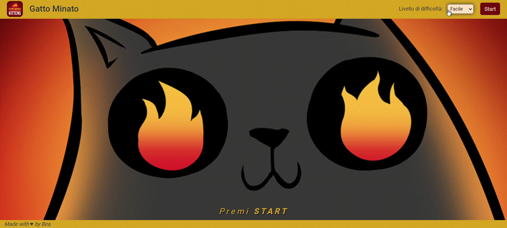

# Minefield - Exploding Kittens

Replica of a simplified version of the game "Minefield" themed Exploding Kittens in HTML, CSS and JavaScript.

## Installation

In order to access the code, go to my GitHub at the following link: https://github.com/BeatriceRocchi/js-campominato-dom.
Now clone the repository, open it in your IDE and just press the GoLive button to open the game in a new browser tab.

## Description

The web app is a simplified version of the game "Minefield" but the theme is inspired by the cards game Exploding Kittens.

To start the game, select the difficulty level from the drop-down menu at the top right and press the start button. The game allows to choose the size of the game board with the same number of exploding kittens:

- easy: 100 cells
- medium: 81 cells
- difficult: 49 cells (less cells and highest possibility to find kittens)

After the click on the start button, the game grid appears in the center of the screen. The player can now click each cell hoping not to find an exploding kitten. The cell turns orange if there is no kitten.

The game ends when the player clicks on an exploding kitten or when he reaches the maximum number of attempts allowed (i.e. when he has revealed all the cells that are not kittens).
At the end of the game the score is shown at the bottom and the game grid reveals the position of all the exploding kittens.
